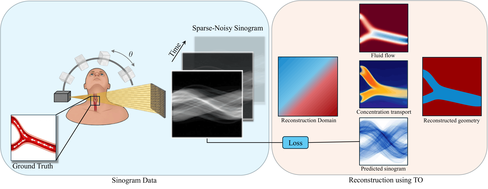

# [VITO: Vascular Geometry and Blood Flow Estimation Using Inverse Topology Optimization](https://arxiv.org/abs/2606.05487)

[Pramod Thombre](https://scholar.google.com/citations?user=pMWVTWIAAAAJ&hl=en), [Rahul Kumar Padhy](https://sites.google.com/view/rahulkp/home), [Roshan M. D'Souza](https://scholar.google.com/citations?user=2PQhIccAAAAJ&hl=en), [Krishnan Suresh](https://scholar.google.com/citations?user=hqoL27AAAAAJ&hl=en)


## Abstract

Computed Tomography Angiography (CTA) is widely used to reconstruct vascular geometry from projection measurements, with conventional approaches such as Filtered Back-Projection (FBP) and Iterative Reconstruction (IR) forming the clinical standard. Blood flow is subsequently estimated through Computational Fluid Dynamics (CFD) simulations, which require vascular geometry and boundary conditions to be specified a priori. Since the geometry is fixed prior to flow estimation, the recovery of unknown anatomical features (e.g., missing branches or stenoses) is precluded. In this work, we present a fluid-physics-constrained reconstruction framework that leverages topology optimization (TO) to jointly recover vascular geometry and blood velocity directly from time-resolved CTA sinograms. The formulation couples a steady incompressible flow model with a transient advection-diffusion contrast transport model, mapped to sinogram space through a differentiable projection operator. The recovered velocity fields provide hemodynamic information and can support downstream estimation of wall shear stress and flow distribution, without requiring a separate CFD pipeline. The proposed method is demonstrated on synthetic phantoms under varying sparsity and noise levels, and on representative projection data.

 

## Data

Geometry and sinogram data required for the code can be downloaded from this [link](https://drive.google.com/drive/folders/1cdHm7m3mqALq_pWkA0CD-ffLm84EN37B?usp=drive_link).

## Citation

```

@article{thombre2026vito,
  title={VITO: Vascular Geometry and Blood Flow Estimation Using Inverse Topology Optimization},
  author={Thombre, Pramod and Padhy, Rahul Kumar and D'Souza, Roshan M and Suresh, Krishnan},
  journal={arXiv preprint arXiv:2606.05487},
  year={2026}
}
```